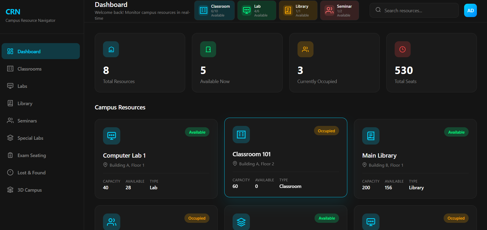
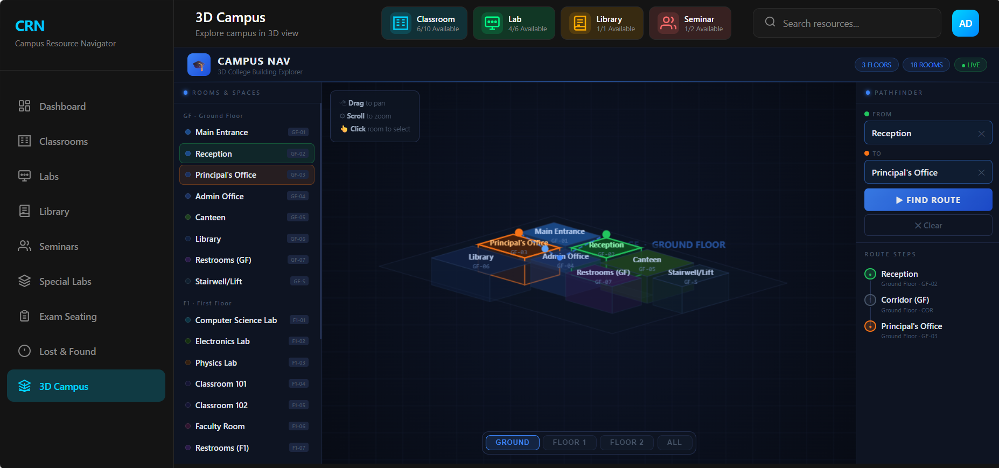

# Campus Resource Management

Campus Resource Management is a full-stack web app for browsing and tracking campus resources such as classrooms, labs, libraries, seminar halls, and special research labs.

## Screenshots




## What is in this repository

- `CRN`: React + Vite frontend (single-page dashboard with module views)
- `backend`: Express + MongoDB API for resource data
- `TODO.md`: current implementation notes

## Features

- Dashboard with resource summary cards and quick navigation
- Classroom search by course, year, and section
- Lab search by type and location
- Library listing with timing and floor details
- Seminar hall filtering by capacity range
- Special lab filtering by research area
- Exam seating module (sample data driven)
- Lost and Found module with in-memory report form
- 3D campus explorer loaded from an embedded HTML model

## Tech stack

- Frontend: React 19, Vite
- Backend: Node.js, Express 5
- Database: MongoDB with Mongoose
- Styling: CSS + inline component styles

## Project structure

```text
Campus-Resource-management/
|-- CRN/
|   |-- public/
|   |   |-- image.png
|   |   `-- image1.png
|   |-- src/
|   |   |-- component/
|   |   |-- assets/3dmodel.html
|   |   |-- App.jsx
|   |   `-- App.css
|   `-- package.json
|-- backend/
|   |-- models/
|   |-- routes/resourceRoutes.js
|   |-- server.js
|   |-- seed.js
|   `-- package.json
`-- README.md
```

## Prerequisites

- Node.js 18+ (recommended)
- npm
- MongoDB running locally or a reachable MongoDB URI

## Setup and run

### 1) Backend setup

```bash
cd backend
npm install
```

Create `backend/.env`:

```env
MONGO_URL=mongodb://127.0.0.1:27017/campus_resource_db
```

Run backend server:

```bash
npm run dev
```

Backend runs on `http://localhost:5000`.

### 2) Seed sample database data

In a new terminal (while backend is running):

```bash
cd backend
node seed.js
```

This calls `POST /api/resources/seed` and populates sample resources.

### 3) Frontend setup

In another terminal:

```bash
cd CRN
npm install
npm run dev
```

Frontend runs on Vite default port (`http://localhost:5173` unless changed).

## API endpoints

Base URL: `http://localhost:5000/api/resources`

- `GET /classrooms` with optional query params: `crn`, `course`, `year`, `section`
- `GET /labs` with optional query param: `type`
- `GET /libraries`
- `GET /seminars` with optional query params: `minCapacity`, `maxCapacity`
- `GET /speciallabs` with optional query param: `researchArea`
- `POST /seed` to reset and seed demo data

## Notes

- The frontend expects backend API at `http://localhost:5000/api/resources`.
- Most resource modules fall back to local sample data if API fetch fails.
- `Exam Seating` and `Lost & Found` currently use client-side sample/in-memory data.
